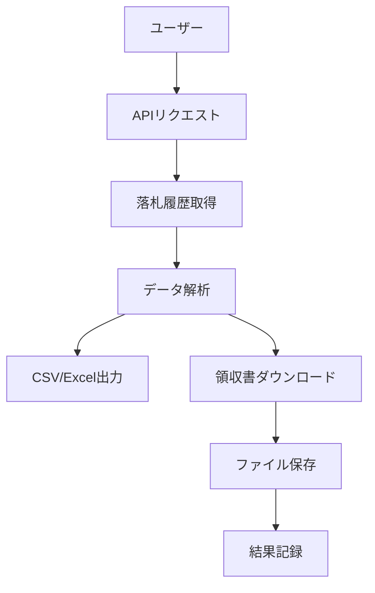

# Yahoo!オークション落札履歴取得・領収書保存ツールの開発依頼

## 1. 提案概要

このプロジェクトでは、Yahoo!オークションの落札履歴を自動取得し、CSVまたはExcel形式で出力するツールを開発します。また、ストア出品者が発行する領収書も自動ダウンロードする機能を追加します。

## 2. 技術選定と理由

### プログラミング言語
- **Python**: 強力なHTTPライブラリ（requests）や解析ライブラリ（BeautifulSoup、pandas）が豊富で、開発効率が高い。
- **Selenium**: JavaScriptを実行できるため、動的なページの操作も容易に可能。

### フレームワーク
- **Flask**: 軽量なWebフレームワークで、APIの作成やバックエンド処理が簡単に行える。

### データベース
- **SQLite**: 小さくて軽量なデータベースで、開発環境に簡単にインストールできる。

### ファイル操作
- **Python標準ライブラリ**: ファイルの保存やダウンロードを容易に行う。

## 3. アーキテクチャ図

## 4. 開発アプローチ

1. **落札履歴取得**: Yahoo!オークションのAPIを使用してログイン状態で「落札分」ページを巡回して情報を取得します。
2. **データ解析**: 取得したデータを解析し、必要な項目（商品タイトル、落札日時など）を抽出します。
3. **CSV/Excel出力**: 抽出したデータをCSVまたはExcel形式で保存します。
4. **領収書ダウンロード**: ストア出品者の取引ページから発行可能な領収書を自動ダウンロードし、PDFで保存します。

## 5. 本提案の強み

1. **落札履歴取得の安定性**: 多数のページを巡回して取得する際も、安定して動作します。
2. **複数ページの処理能力**: 順に複数ページを巡回し、重複データを判定しながら情報を取得します。
3. **領収書ダウンロード機能**: 領収書が複数ページある場合も漏れなく保存し、未発行やダウンロードできない場合は記録します。